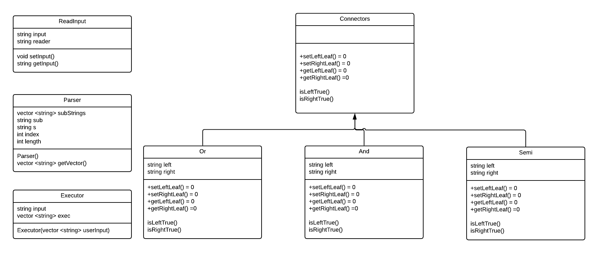

# CS 100 Programming Project

Winter 2020\
Anthony Pan 862119435\
Joshua Torres 861221634

# Introduction

This is a command shell, called R'Shell, developed in C++. In this R'Shell, the user will be prompted with "$" for one command line input at a time, with connectors. The user is able to see directories using "ls". The valid connectors are "&&", "||", and ";" that function as they should in a regular shell. The user is able to print out what they have typed using the "echo" input. Comments are available by using "#". R'Shell will repeatedly read and execute command line input until the "exit" command is executed.

# OMT Diagram

Arrays should be replaced with vectors.
# Classes
ReadInput - Single class responsible for printing $ and accepting input\
Parser - Takes input and creates tokens. Makes a vector that holds our commands and connectors.\
Executor - Single class responsible for executing the commands inputed by the user. Takes the output of Parser and runs execvp().\
Base - Abstract parent class that will serve as the base for our connectors.\ \
And - Inherits from Base Class and will process when the user inputs "&&". If first arguement passes, run the second arguement. If second arguement passes, output both. Executor is ran in here to do logic testing.\ \
Or - Inherits from Base Class and will process when the user inputs "||". If first arguement passes only output first. If first arguement fails, run second arguement. If second arguement passes, output. Executor is ran in here to do logic testing.\ \
Semi -Inherits from Base Class and will process when the user inputs ";". Takes both children leaves and runs them both, regardless of whether one fails or not. Executor is ran in here to do logic testing.\ \
Exit - Closes the R'Shell
# Prototypes/Research
fork(), execvp(), waitpid() - Created a small program (for_demo.cpp) to experiment with fork(), pid, and how children work. At this point we have a clear understanding on how to use these functions together and implament them within our Executor Class. \ \

Shunting Yard - In order to build our expression tree with correct precedence, we are experementing with using the Shunting Yard algorithm. \ \

# Development and Roadmap Testing
Anthony Pan | Joshua Torres
------------ | -------------
[X] Create ReadInput Class| [X] Create Base Class
[---] Create Token Class | [X] Create And
[---] Create Tokenizer Class | [X] Create Or
[X] Create Executor Class | [X] Create Semi
[ ] Create Exit Class | [X] Create Unit Tests
[X] Figure out 'Test' functionality | [ ] Figure out parentheses precedence functionality
